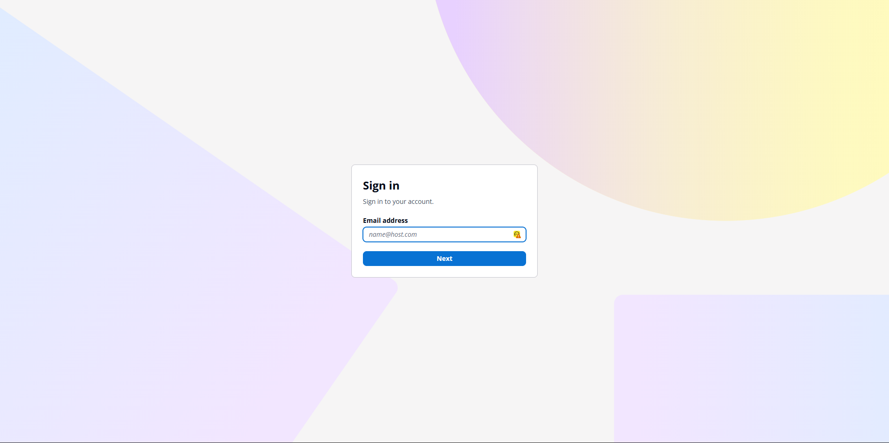
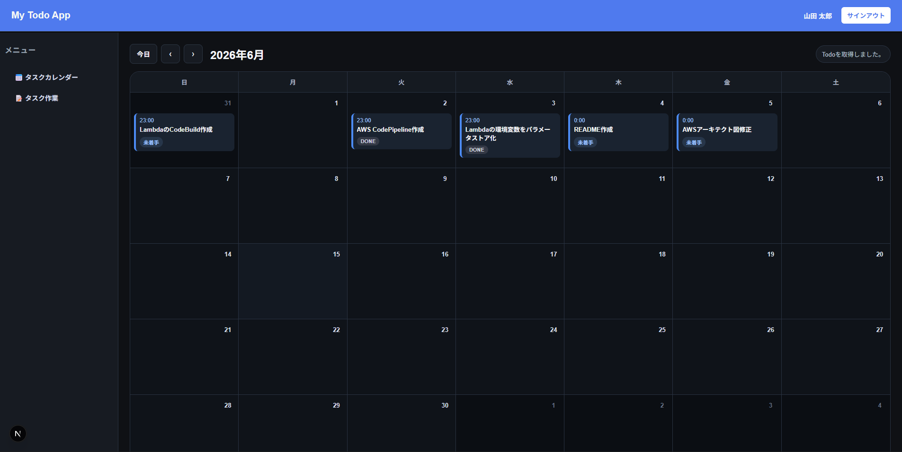
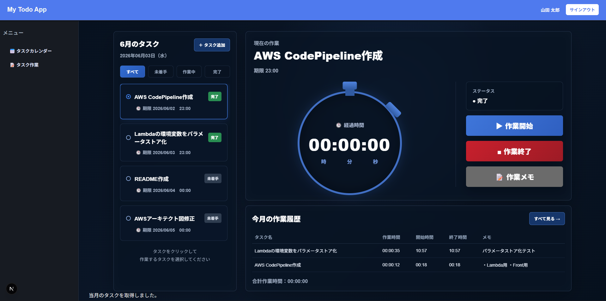
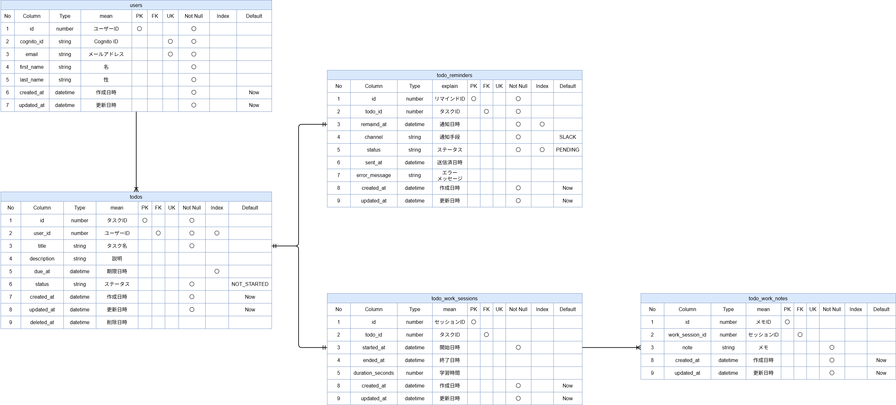

# ToDo Application

## 概要

AWS上に構築したタスク管理アプリケーションです。

単純なToDo管理だけではなく、作業開始・終了による工数計測機能や作業メモ機能を実装しています。

フロントエンドとバックエンドを分離し、認証にはAmazon Cognito、APIにはAPI Gateway + Lambda、データベースにはAurora PostgreSQLを採用しています。

また、CodePipeline・CodeBuildを利用したCI/CDパイプラインを構築し、ソースコードの変更からデプロイまでを自動化しています。

---

## デモ画面

### ▪ ログイン画面



### ▪ カレンダー画面



### ▪ 作業管理画面



---

## 開発背景

本プロジェクトは、AWSを利用したWebアプリケーション開発およびクラウドサービスの理解を深めることを目的として開発しました。

AWSの学習を進める中で、単に資格取得を目指すだけではなく、実際にサービスを構築・運用する経験が重要であると考え、本プロジェクトの開発を開始しました。

開発当初はAWS認定ソリューションアーキテクト アソシエイト（SAA）の学習を通じて各サービスの概要を理解することから始めましたが、その中で実際に利用してみたいと感じたサービスを組み合わせ、タスク管理アプリケーションとして形にしました。

---

## アプリケーションの目的

日々のタスク管理だけではなく、

- どのタスクにどれだけ時間を使ったか
- 作業内容をどのように記録するか

を管理できるアプリケーションとして開発しました。

AWSの各種マネージドサービスを利用し、実運用を意識した構成を目指しています。

---

## 学習環境

- Windows 11
- Visual Studio Code
- Next.js
- TypeScript
- Node.js
- AWS

---

## 主な機能

### タスク管理

- タスク登録
- タスク編集
- タスク削除
- ステータス管理

### カレンダー表示

- 月間カレンダー表示
- 期限日の可視化

### 作業管理

- 作業開始
- 作業終了
- 作業時間計測

### 作業履歴

- 作業履歴表示
- 作業時間集計

### メモ機能

- 作業メモ登録
- 作業履歴との紐付け

### 認証機能

- Amazon Cognitoによる認証
- JWT認証

---

## 使用技術

| 分類                 | 技術                                   |
| -------------------- | -------------------------------------- |
| Frontend             | Next.js, TypeScript                    |
| Container            | ECS Fargate                            |
| API                  | API Gateway                            |
| Backend              | AWS Lambda(Node.js)                    |
| Database             | Amazon Aurora PostgreSQL Serverless v2 |
| Authentication       | Amazon Cognito                         |
| CI/CD                | CodePipeline, CodeBuild                |
| Container Registry   | ECR                                    |
| CDN                  | CloudFront                             |
| Load Balancer        | ALB                                    |
| Parameter Management | Systems Manager Parameter Store        |
| Encryption           | AWS KMS                                |

---

## AWSサービス選定理由

### ▪ ECS Fargate

本システムのフロントエンドはNext.jsで構築しています。

静的コンテンツのみであればS3 + CloudFrontでも実現可能ですが、
将来的なSSR対応やコンテナ運用の学習を目的としてECS Fargateを採用しました。

採用理由は以下の通りです。

- AWS学習の一環としてECS/ECRを利用したコンテナ運用を経験したかったため
- サーバー管理が不要であり運用負荷を軽減できるため
- コンテナ単位でデプロイ可能でありCI/CDとの親和性が高いため
- 将来的なSSRやバックエンドサービスのコンテナ化にも対応しやすいため

### ▪ Lambda

設計当初はバックエンドもECS上で稼働させる構成を検討しました。

しかし、本システムのAPIは

- Todo取得
- Todo登録
- 作業開始
- 作業終了
- メモ登録

など短時間で完結する処理が中心であり、
常時サーバーを起動しておく必要がありません。

そのためLambda + API Gatewayを採用しました。

採用理由は以下の通りです。

- 利用した分だけ課金されるためコスト効率が良い
- 常時稼働サーバーが不要
- API単位で責務を分離しやすい
- AWSマネージドサービスとの親和性が高い
- 将来的な機能追加時もLambda単位で拡張しやすい

### ▪ Amazon Aurora PostgreSQL Serverless v2

本システムは

- ユーザー
- タスク
- 作業履歴
- 作業メモ

といった複数テーブル間の関連を扱います。

DynamoDBでも実現可能ですが、

- リレーションを自然に表現できる
- JOINによる履歴取得が容易
- SQLによる集計処理が行いやすい

という理由からAmazon Aurora PostgreSQL Serverless v2を採用しました。

### ▪ Cognito

本システムではAWSマネージドサービスを活用し、
安全な認証基盤を利用するためAmazon Cognitoを採用しました。

また、業務でも利用頻度の高いサービスであるため学習目的も兼ねています。

### ▪ Parameter Store

DB接続情報などの機密情報を安全に管理するため採用しました。

環境変数へ直接パスワードを設定するのではなく、

- Parameter Store
- SecureString
- KMS

を利用して暗号化管理しています。

またLambdaからはVPC Endpoint経由でアクセスすることで、
インターネットを経由しない構成としています。

---

## アーキテクチャ

### ▪ システム構成図


### ▪ 構成概要

- フロントエンドはNext.jsをECS Fargate上で稼働
- APIはAPI Gateway + Lambdaで実装
- DBはAurora PostgreSQL Serverless v2
- 認証はAmazon Cognito
- DB接続情報はParameter Storeで管理

---

## インフラ構成

### ▪ ECS Fargate

フロントエンドアプリケーションをホストしています。

### ▪ Lambda

下記機能ごとにLambdaを分割し責務を明確化しています。

#### Todo API

- Todo取得
- Todo登録
- Todo更新
- Todo削除

#### Work Session API

- 作業開始
- 作業終了
- 作業履歴取得

#### Note API

- メモ登録
- メモ取得

### ▪ Amazon Aurora PostgreSQL Serverless v2

アプリケーションデータを管理しています。

### ▪ VPC

アプリケーション全体をプライベートネットワーク上に構築しています。

### ▪ VPC Endpoint

LambdaからSSMおよびKMSへPrivate接続するために利用しています。

### ▪ Parameter Store

データベース接続情報をSecureStringとして管理しています。

---

## セキュリティ設計

### ▪ Cognito認証

ユーザー認証はAmazon Cognitoを利用しています。

認証成功後に発行されるJWTトークンを利用してAPIアクセス制御を行っています。

### ▪ DB接続情報管理

Aurora 接続情報はLambda環境変数へ直接設定せず、Parameter Storeで管理しています。

### ▪ KMSによる暗号化

Aurora 接続情報にあるパスワードはParameter StoreはSecureStringを利用し、KMSで暗号化しています。

### ▪ VPC Endpoint利用

LambdaからSSMおよびKMSへアクセスする際はVPC Endpointを利用しています。

インターネットを経由せずAWSネットワーク内で通信する構成としています。

### ▪ Aurora配置

Aurora はPrivate Subnet内へ配置しています。

外部ネットワークから直接アクセスできない構成としています。

---

## ネットワーク設計

### Security Group設計

#### ECS Security Group

##### Inbound

| Protocol | Port | Source |
| -------- | ---- | ------ |
| TCP      | 3000 | ALB SG |

##### Outbound

| Protocol | Port | Destination |
| -------- | ---- | ----------- |
| All      | All  | 0.0.0.0/0   |

※ フロントエンドからの外部通信を考慮し、Outboundは全許可としています。

---

#### Lambda Security Group

##### Outbound

| Protocol | Port | Destination     |
| -------- | ---- | --------------- |
| TCP      | 5432 | Aurora SG       |
| TCP      | 443  | VPC Endpoint SG |

---

#### Aurora Security Group

##### Inbound

| Protocol | Port | Source    |
| -------- | ---- | --------- |
| TCP      | 5432 | Lambda SG |

---

#### VPC Endpoint Security Group

##### Inbound

| Protocol | Port | Source    |
| -------- | ---- | --------- |
| TCP      | 443  | Lambda SG |

---

## IAM設計

### Lambda実行ロール

```json
ssm:GetParameter
kms:Decrypt
logs:CreateLogGroup
logs:CreateLogStream
logs:PutLogEvents
```

### CodeBuild実行ロール

```json
ecr:*
ecs:*
lambda:UpdateFunctionCode
s3:GetObject
```

最小権限を意識して付与しています。

---

## CI/CD

### Frontend

```text
CodeCommit
 ↓
CodePipeline
 ↓
CodeBuild
 ↓
Docker Build
 ↓
ECR Push
 ↓
ECS Deploy
```

### Lambda

```text
CodeCommit
 ↓
CodePipeline
 ↓
CodeBuild
 ↓
ZIP作成
 ↓
Lambda更新
```

---

## DB設計

### ER図



### 設計ポイント

本システムでは、

- users
- todos
- todo_work_sessions
- todo_work_notes

の4テーブルで構成しています。

ユーザーとタスクを1対多で管理し、
タスクごとの作業履歴および作業メモを管理できる構成としました。

作業履歴とメモを分離することで、

- 1つのタスクを複数回実施できる
- 作業ごとにメモを記録できる
- 将来的な工数集計や分析に対応しやすい

設計としています。

---

## 工夫した点

- Lambda環境変数からParameter Storeへ移行
- DB接続パスワードをParameter Store(SecureString) + KMSで暗号化管理
- VPC Endpoint利用によるPrivate通信
- Lambda内でSSM取得結果をキャッシュ
- Lambdaを機能単位で分離
- Reactコンポーネント分割による保守性向上

---

## 苦労した点・解決方法

### LambdaからSSM取得時のタイムアウト

#### ▪ 原因

Aurora をPrivate Subnetに配置していたため、
LambdaもVPC接続で構築しました。

しかしVPC接続したLambdaからは、
AWS Systems Manager Parameter Storeへの通信経路が存在せず、
DB接続情報取得時にタイムアウトが発生しました。

#### ▪ 対応

Systems ManagerおよびKMS向けの
Interface VPC Endpointを作成しました。

また、VPC EndpointのSecurity Groupで
HTTPS(443)を許可することで、

Lambda
→ VPC Endpoint
→ Parameter Store
→ KMS

の通信経路を確立し解決しました。

---

### HTTPS化およびCognito認証連携のためのCloudFront導入

#### ▪ 原因

当初は

Client → ALB → ECS (Next.js)

アプリケーション自体は動作していましたが、

- HTTP通信となる
- Cognito Hosted UIとの連携を考慮するとHTTPS化が必要
- 公開URLとしてALBのDNS名を利用することになる

という課題がありました。

#### ▪ 解決方法

HTTPS化する方法として、

- Route53 + ALB
- CloudFront + ALB

の構成を比較しました。

結果としてCloudFrontを採用しました。

主な理由は以下の通りです。

- HTTPS通信を実現できる
- Cognito Hosted UIとの連携が容易
- 将来的なWAF導入が容易
- ALBを直接公開しない構成を実現できる

---

### AWSサービス間の通信設計

#### 原因

本プロジェクトでは

- ECS
- ALB
- Lambda
- API Gateway
- Amazon Aurora PostgreSQL Serverless v2
- Cognito
- Parameter Store
- VPC Endpoint

など複数のAWSサービスを利用しています。

サービス自体は作成できても、

- どのサービス同士が通信するのか
- Security Groupをどこに設定するのか
- IAMロールにどの権限を付与するのか
- なぜ通信できないのか

を理解することに苦労しました。

実際に以下のような問題が発生しました。

- ALBからECSへルーティングできない
- LambdaからAuroraへ接続できない
- LambdaからParameter Storeへアクセスできない
- Cognito認証後にAPIへアクセスできない

#### 対応

アーキテクチャ図を作成し、

- 通信元
- 通信先
- 利用ポート
- Security Group
- IAM権限

を整理しながら検証を行いました。

問題発生時はCloudWatch Logsや各AWSサービスのログを確認し、

原因を切り分けながら修正を実施しました。

その結果、

AWSにおける

- ネットワーク設計
- Security Group設計
- IAM設計
- 認証認可設計

について理解を深めることができました。

---

## 学習できたこと

本プロジェクトを通じて以下を学習しました。

- Cognitoによる認証設計
- JWT認証
- ECSによるコンテナ運用
- Lambdaによるサーバレス設計
- Aurora PostgreSQL設計
- Security Group設計
- IAM設計
- VPC Endpoint設計
- Parameter Storeによる機密情報管理
- CodePipeline / CodeBuildによるCI/CD

---

## 今後の改善

- TerraformによるIaC化

  AWSコンソールで手動作成しているリソースをTerraformでコード化し、
  環境構築の再現性向上と設定変更履歴の管理を行いたいです。

- CloudWatch Alarm導入

  CloudWatch Alarmを導入し、Lambdaエラー、API Gatewayの5xx、

  ECSタスク停止、Auroraの負荷上昇を検知できるようにしたい。

---
